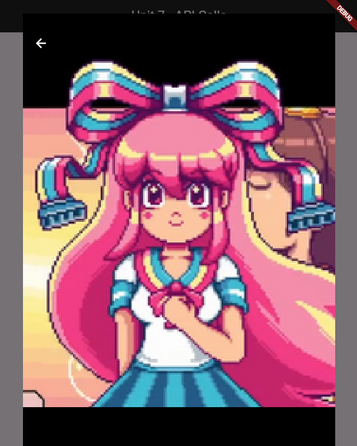

# Unit 7 Assignment
by: Joven Carl Rex P. Biaca

### This project is a simple Flutter app that fetches and displays a list of Disney characters using the Disney API. Each character's name, image, and additional details are shown in a list, and users can view character images in full-screen mode by tapping on them.

## Preview

When image is clicked:

 